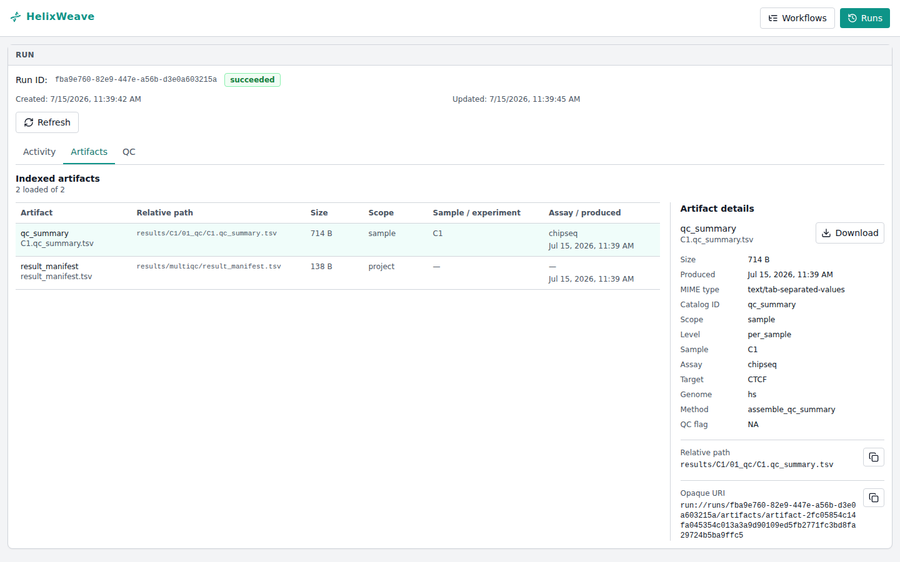
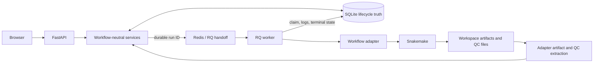
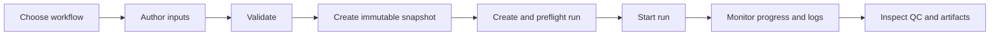

# HelixWeave

**Local omics analysis, from reviewed inputs to durable evidence.**

[](https://github.com/ZichenYang-glitch/ENCODE-style-ChIPseq-CUT-Tag-pipeline/actions/workflows/ci.yml)
[](https://github.com/ZichenYang-glitch/ENCODE-style-ChIPseq-CUT-Tag-pipeline/actions/workflows/lint.yml)
[](LICENSE)

HelixWeave is a local, workflow-neutral omics analysis platform. Its first
adapter provides reproducible ENCODE-style epigenomics workflows.

It is built for a workstation or a small trusted team: author inputs from an
adapter-owned schema, validate them into an immutable snapshot, execute a
durable local run, and review logs, QC, and artifacts in the browser.



_A real deterministic platform demo. It exercises the persisted run, artifact,
and download path; it is not a scientific-data validation result._

## How it works



SQLite is the canonical store for lifecycle and indexed result metadata.
Redis/RQ is the execution boundary, not a second source of lifecycle truth.
Scientific rules and file semantics remain owned by the selected adapter and
workflow.

## What works today

| Track | Journey | Current implementation |
| :--- | :--- | :--- |
| **Platform** | Author → validate → run → results | Schema-driven config/sample authoring, structured validation, immutable validated snapshots, durable execution, run history, logs, QC, artifacts, and downloads. |
| **ENCODE adapter** | FASTQ/config → Snakemake → scientific outputs | ChIP-seq, CUT&Tag, ATAC-seq, and MNase-seq policies, environments, DAGs, artifacts, and QC extraction. |

| Capability | Available now |
| :--- | :--- |
| Input authoring | Adapter-owned JSON Schema drives supported config fields, samples, options, and review. Advanced YAML and TSV import remain available. |
| Validation | Server validation returns structured issues and an immutable, expiring validated snapshot for run creation. |
| Lifecycle | File-backed SQLite persists runs, events, logs, assignments, cancellation intent, and result metadata across API restarts. |
| Local execution | Redis/RQ hands a durable run identity to an independent worker that executes the real Snakemake process. |
| Run control | Preflight, explicit start, progress, live persisted logs, and acknowledged process-group cancellation. |
| Evidence | Filterable run history, indexed artifacts, fail-closed downloads, and a QC workbench with source-artifact navigation. |

The default registry currently contains one adapter. The platform contracts are
workflow-neutral, but onboarding another workflow still requires an explicit
adapter and deployment integration.

## Five-minute local demo

From a fresh clone, create the locked local environment and install the
frontend. Download time varies by machine and package cache.

```bash
git clone https://github.com/ZichenYang-glitch/ENCODE-style-ChIPseq-CUT-Tag-pipeline.git
cd ENCODE-style-ChIPseq-CUT-Tag-pipeline

micromamba create -p .local/envs/ci-fast --file workflow/envs/ci-fast.lock
./.local/envs/ci-fast/bin/python -m pip install --no-index --no-deps \
  --no-build-isolation -e ".[api]"
./.local/envs/ci-fast/bin/python -m pip check
npm --prefix frontend ci
export PATH="$PWD/.local/envs/ci-fast/bin:$PATH"
python scripts/run_local_platform.py --doctor
```

Start the deterministic input-to-results demo:

```bash
python scripts/run_local_platform.py --input-authoring-demo
```

Open <http://127.0.0.1:5173>, choose the ENCODE workflow, and select
**Author inputs**. The launcher prints
`.local/results-visibility-demo/results-visibility-inputs.json`; use its
`resultsConfig` in YAML mode and import the TSV at `samplesPath`. Then:

1. Review and validate the inputs.
2. Create the run from the validated snapshot.
3. Wait for preflight, then select **Start run**.
4. Follow activity and logs until the run succeeds.
5. Inspect the indexed QC metrics and download the source artifact.

Press `Ctrl-C` once to stop services started by the launcher. The demo uses a
controlled synthetic project and proves the platform journey, not scientific
correctness. See the [local runtime guide](docs/development/local-platform-runtime.md)
for prerequisites, storage, port overrides, process ownership, and cleanup.

## User journey



The browser never turns a draft directly into execution. Only a successful
server validation can create the snapshot consumed by run creation.

## First adapter: ENCODE-style epigenomics

The bundled adapter uses Snakemake and preserves the existing
`encode-style-chipseq-cuttag-atac-mnase` workflow identity.

| Assay | Layout | Implemented core path | Important boundary |
| :--- | :--- | :--- | :--- |
| ChIP-seq | SE / PE | MACS3 narrow or broad peaks, signal tracks, QC, controls, and replicate-aware outputs | Advanced reproducibility follows the maintained policy. |
| CUT&Tag | SE / PE | MACS3 narrow or broad peaks and CUT&Tag fragment-size QC | Optional SEACR sidecar applies only to eligible PE samples. |
| ATAC-seq | SE / PE | Tn5-aware MACS3 narrow peaks, signal tracks, and QC | Broad peaks and footprinting are not implemented. |
| MNase-seq | PE only | Sub/mono/di fragment BAMs, dyad and mono-occupancy tracks, QC, and pooled outputs | No dedicated DANPOS3, iNPS, or SEM caller is implemented. |

For assay-specific truth, use the [configuration reference](docs/configuration.md),
[sample sheet reference](docs/sample-sheet.md),
[QC guide](docs/qc-interpretation.md), and
[reproducibility policy](docs/reproducibility-policy.md).

Create the locked scientific runner and validate the committed example
metadata:

```bash
micromamba create -n chipseq-runner --file workflow/envs/runner.lock
micromamba activate chipseq-runner
python3 scripts/validate_samples.py --config config/config.yaml
```

The example FASTQ paths are illustrative. Before a Snakemake dry-run, edit
`config/config.yaml` and `config/samples.tsv` to reference real inputs, then
follow the [scientific quick start](docs/quickstart.md). Execution, controls,
reference preparation, containers, and troubleshooting belong there and in
the [environment guide](docs/environments.md).

## Extension boundary

| Area | Owns |
| :--- | :--- |
| `src/encode_pipeline/platform/` | Workflow-neutral domain contracts. |
| `src/encode_pipeline/services/` | Validation, planning, submission, execution, cancellation, and result orchestration. |
| `src/encode_pipeline/api/` | Thin HTTP translation over public service contracts. |
| `src/encode_pipeline/persistence/` | SQLite repositories and Alembic migrations. |
| `src/encode_pipeline/workers/` | Redis/RQ execution mechanics and process ownership. |
| `src/encode_pipeline/adapters/` | Workflow-specific schemas, validation, planning, commands, artifacts, and QC extraction. |
| `workflow/` | Snakemake rules, scientific configuration, environments, and outputs. |
| `frontend/` | Workflow, authoring, run, artifact, and QC experience. |

This boundary does not imply arbitrary zero-configuration workflow loading.
The current command/build composition is still tied to the bundled repository
source; see [adapter conformance](docs/development/adapter-conformance.md).

## Documentation

| Topic | Maintained reference |
| :--- | :--- |
| Platform design and safety | [Architecture overview](docs/architecture/platform-overview.md) |
| Local stack and deterministic demo | [Local runtime](docs/development/local-platform-runtime.md) |
| Adapter contract | [Adapter conformance](docs/development/adapter-conformance.md) |
| Scientific setup | [Quick start](docs/quickstart.md), [environments](docs/environments.md), [containers](docs/container-usage.md) |
| Inputs | [Configuration](docs/configuration.md), [sample sheet](docs/sample-sheet.md), [reference resources](docs/reference-resources.md) |
| Evidence | [Output contract](docs/output-contract.md), [artifact inventory](docs/architecture/artifact-inventory.yaml), [QC interpretation](docs/qc-interpretation.md) |
| Quality and testing | [Development harness](docs/development/harness.md), [quality baseline](docs/development/coverage-policy.md) |
| Current direction and limits | [Product roadmap](docs/development/workflow-platform-agent-roadmap.md), [known issues](KNOWN_ISSUES.md) |

## Development and testing

Use the smallest gate that matches the change:

```bash
python3 -m pytest test/docs/test_internal_links.py -v
python3 -m pytest test/workflow/test_smoke_profiles.py -v
npm --prefix frontend test -- --run
```

The [development harness](docs/development/harness.md) defines PR-fast,
full-main, real-execution, frontend, browser, lint, and lock layers. Current
measured test and coverage facts have one authoritative home in the
[quality baseline](docs/development/coverage-policy.md).

## Current limits

- Deployment is local or for a small trusted team. Authentication,
  multi-tenancy, HPC/cloud backends, Kubernetes, object storage, and remote
  workspace semantics are not implemented.
- The ENCODE-style epigenomics workflow is the only registered adapter today.
- The Agent surface is read-only: it cannot submit, start, cancel, modify, or
  delete runs, and its explanations are not provenance.
- The deterministic platform demo does not replace real scientific validation,
  and no public biological dataset is bundled.
- Automatic QC thresholds/conclusions and worker heartbeat/lease reconciliation
  are not implemented.

See [Known Issues](KNOWN_ISSUES.md) for the maintained scientific and
operational boundaries.

## License

HelixWeave is available under the [MIT License](LICENSE).
