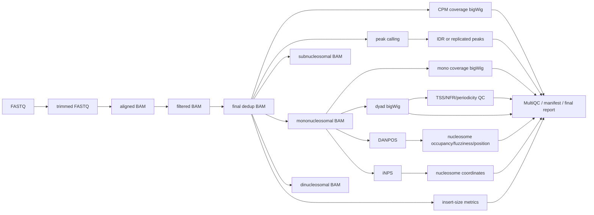
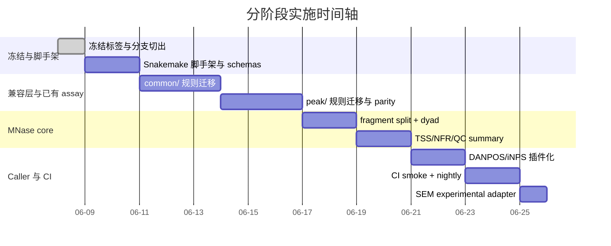

<!--
ARCHIVED — 2026-06-06

This document was written during the shell-pipeline era (scripts/chipseq.sh).
It remains useful as directional artifact-oriented research and the staged
roadmap concepts (artifact graph, assay policy, targets resolver) still inform
the project's long-term architecture thinking.

Its concrete migration plan is OUTDATED: the project is now a Snakemake
workflow with target-helper functions, assay-specific rule files, and
four supported assays (ChIP-seq, CUT&Tag, ATAC-seq, MNase-seq).

Do NOT treat this as a current implementation plan.
-->

# 为 ENCODE-style ChIPseq CUT-Tag Pipeline 增加 MNase-seq 的最小风险重构方案

## 执行摘要

以公开仓库当前 `main` 为基线，这个项目目前仍是一个**单主脚本、单环境、peak-centric 输出**的 Shell pipeline：核心入口是 `scripts/chipseq.sh`，依赖集中在 `chipseq.yml`，README 描述的主流程是 `FastQC → Trim Galore → Bowtie2 → Samtools 过滤 → Picard/Samtools 去重 → MACS3 → deepTools`，默认输出目录是 `00_raw/`、`01_qc/`、`02_align/`、`03_bigwig/`、`04_peaks/`；仓库页面同时显示它目前只有 8 次提交、语言 100% 为 Shell，且尚未发布任何 release。基于这个事实，最稳妥的做法不是“就地重写”，而是走**兼容式双入口**路线：先在新分支中并行引入 `workflow/`（Snakemake 工作流、轻量模型层、policy 层、schema 与 CI），同时**保留现有 ChIP/CUT&Tag 的 CLI 与输出路径不变**，等 chip/cuttag 结果对齐后，再把 MNase-seq 作为第一条 non-peak-centric assay 接进去。citeturn42view0turn42view1turn42view2

这个 refactor 的核心思想应当不是“把 `--tech` 从 `chip|cuttag` 扩展成 `chip|cuttag|mnase`”，而是把流程控制从“参数驱动的 rule if/else”提升成**artifact-oriented、assay-policy driven**：由 `Sample` 描述样本事实，由 `Artifact` 描述可追踪产物，由 `AssayPolicy YAML` 定义不同 assay 的终端目标、片段分层、caller、QC 与约束；`rule all` 不再硬编码“峰文件一定是终点”，而是通过 targets resolver 按 policy 解析每个 assay 的 terminal artifacts。Snakemake 原生支持 YAML/JSON 配置、表格样本表、JSON Schema 验证、模块化 include、输入函数以及按 rule 隔离的 conda/container，这正好适合做这类低风险、渐进式重构。citeturn12view0turn13view0turn13view3turn46view1turn47view1

MNase 之所以必须作为“第一条非 peak-centric assay”来驱动这次架构升级，是因为它的终点不再是 peak BED，而是**片段分层 BAM、单核小体 occupancy bigWig、dyad bigWig、核小体 caller 结果和一组 nucleosome QC 指标**。deepTools 明确说明 `bamCoverage --MNase` 只统计每个片段中心 3 nt、要求 paired-end，并建议 `binSize=1`，默认只考虑 130–200 bp 片段；而你上传的 MNase 设计文档已经把默认片段层级倾向于 `sub<140 / mono 140–200 / di 300–400`，并且把 DANPOS3、iNPS、SEM 和 CAM 风格 QC 放进了设计候选。最重要的工程判断因此是：**MNase core DAG 必跑，caller 插件化，SEM 默认关闭，DANPOS/iNPS 至少先做 optional/nightly，不要首版就把所有老工具放进 PR 级 CI**。citeturn23view0turn24view0turn24view1turn43view0turn27view1turn27view5turn27view6turn27view7 fileciteturn0file0

在实施上，我建议直接新建长期特性分支 `refactor/artifact-policy-mnase-v1`，并在切分支前打冻结标签 `checkpoint/pre-refactor-shell-main-20260605`。整个分支的最小可交付目标不是“一口气把所有 assay 都重写完”，而是四件事：其一，建立 Snakemake 工作流脚手架与 schema/CI；其二，把现有 chip/cuttag 逻辑迁入 `common/ + peak/`，但**对外路径与结果保持兼容**；其三，实现 MNase core（片段分层、mono coverage、dyad、insert-size QC、TSS/NFR profile、summary）；其四，把 DANPOS/iNPS/SEM 做成 policy-controlled optional callers。按一个保守但现实的估算，完整分阶段落地约 **72–88 小时**，其中真正高风险的部分不是 dyad bigWig，而是**旧 caller 的环境隔离、路径兼容和 CI 设计**。citeturn42view0turn42view2turn46view2turn47view1turn48view0

## 基线判断与设计原则

### 基线快照

当前公开仓库对外暴露的是一个“ENCODE-style ChIP-seq & CUT&Tag Pipeline”，README 中说明该仓库主要由 `chipseq.yml`、`scripts/chipseq.sh` 和 `.gitignore` 组成；脚本接受 `--tech chip|cuttag` 与 `--peakMode narrow|broad`，并把终端输出收敛到 `03_bigwig/` 和 `04_peaks/`。仓库页面同时显示它没有 release，历史提交也很少。这意味着：你今天要加 MNase，不是在一个已经模块化的 workflow 里“补一层 rules”，而是在一个**脚本型、峰导向、接口已被真实使用的项目**上做架构转型，所以必须优先保护已有 ChIP/CUT&Tag 用户和已有结果路径。citeturn42view0turn42view1turn42view2

Snakemake 官方推荐的仓库结构，正好与这种“脚本库向可维护 workflow 迁移”的目标一致：它建议把工作流组织为 `workflow/rules`、`workflow/envs`、`workflow/scripts`、`config`、`results`，并显式加入 `.tests/integration` 与 `.tests/unit`。同时，Snakemake 的配置层既支持 YAML/JSON 配置，也支持表格化样本表，并且可以用 JSON Schema 对配置和样本表分别做校验，还能通过默认值自动补全缺省项。对一个要引入“assay policy + artifact graph + smoke test”的项目来说，这比继续在 shell 中堆 `case`/`if` 更可控。citeturn12view0turn46view1turn46view2

### 重构原则

我建议把这次 refactor 钉死在三条原则上。第一，**兼容优先于纯粹**：首版不要以“最漂亮的新目录树”为目标，而要以“旧 ChIP/CUT&Tag 路径默认不变、老用户不需要重学命令”为目标。第二，**产物优先于参数**：不是让 Snakemake 读到 `assay=mnase` 后在每个 rule 里东一刀西一刀地改逻辑，而是先定义“每个 assay 的终端产物清单”，再让 DAG 去满足这些产物。第三，**显式 policy 优先于散落参数**：片段边界、是否需要 control、是否启用 IDR、是否启用 `--MNase`、哪些 QC 是 hard gate，全部放进 YAML policy，而不是散落在 rules 里。Snakemake 的 schema 验证和输入函数天然支持这一路线；nf-core 的模块指南也强调模块不要硬编码业务元数据，而是把 metadata 作为外部注入，从而减少模块内部耦合。citeturn12view0turn13view3turn41view3

还有一个容易被忽略、但在 MNase 里会直接造成结果不一致的细节：deepTools `--MNase` 默认窗口是 **130–200 bp**，而你的设计文档把 mono 定义偏向 **140–200 bp**。如果不把这两者在 policy 里统一成**显式传参**，同一份 mono BAM 与同一张 dyad bigWig 的“片段定义”会悄悄发生漂移。同理，iNPS README 对 paired-end 的默认阈值是 `pe_min=100`、`pe_max=200`，这同样与 `140–200` 不一致。因此，**所有 caller 和 signal rule 的片段边界都必须集中从 policy 注入，不允许任何 rule 偷吃工具默认值**。citeturn23view0turn27view1 fileciteturn0file0



上图对应的关键抽象是：ChIP/CUT&Tag/ATAC 的“终点”往往仍然是 peak-centric 产物，但 MNase 的“终点”已经变成 `signal + nucleosome calls + QC` 的组合包。也正因为如此，MNase 最适合作为你这个仓库第一次引入 artifact graph 的触发器。对于未指定的基因组版本、物种、read type，我建议整体保持无特定约束，只把 `genome`、`layout`、参考索引和注释文件做成参数化配置；**唯一主动收紧**的是 MNase v1 先限定 PE，因为 deepTools `--MNase` 明确要求 paired-end。citeturn23view0turn12view0

## 分支策略与迁移安全网

### 推荐分支、标签与合并方式

由于当前公开仓库没有 release 可以作为“现成回滚点”，而且对外暴露的仍是 `scripts/chipseq.sh` 单脚本入口，我建议在动任何结构之前，先做一次**冻结标签 + 长期特性分支**切分。公开页面显示这个仓库没有发布 release，因此标签会比“靠记忆回滚”稳得多。citeturn42view2

| 项目 | 建议值 | 目的 |
|---|---|---|
| 冻结标签 | `checkpoint/pre-refactor-shell-main-20260605` | 固化当前 shell 基线 |
| 长期开发分支 | `refactor/artifact-policy-mnase-v1` | 承载全部重构与 MNase 落地 |
| 可选冻结分支 | `legacy/shell-main` | 给习惯 branch 回溯的协作者使用 |
| 合并策略 | `--no-ff` merge | 未来一键 `git revert -m 1 <merge_commit>` |
| 主分支准入 | `schema-validate + chipseq-smoke + mnase-smoke` 全绿 | 避免半成品进入 main |

建议的初始 Git 操作如下：

```bash
git switch main
git pull --ff-only
git tag -a checkpoint/pre-refactor-shell-main-20260605 -m "Freeze shell-based main before Snakemake refactor"
git switch -c refactor/artifact-policy-mnase-v1
```

### 提交计划

真正的低风险，不在于“少改文件”，而在于**把兼容层、模型层、MNase 核心、caller 插件、CI**分开提交，这样每一步都可独立回滚。下面这套 commit 颗粒度比较适合你这个仓库体量。它以当前 shell 基线为出发点，先建脚手架，再迁移已有 assay，最后加 MNase。这个顺序与 Snakemake 推荐的可测试 workflow 目录结构也一致。citeturn46view1turn46view2

| 建议提交 | 内容 | 回滚点 |
|---|---|---|
| `chore: freeze legacy shell interface` | 文档注明 shell 基线，保留 `scripts/chipseq.sh` 原样 | `checkpoint/pre-refactor-shell-main-20260605` |
| `feat: scaffold snakemake workflow skeleton` | 新增 `workflow/`, `config/`, `.tests/`, `profiles/`, `schemas/` | `checkpoint/scaffold-ready` |
| `feat: add sample artifact and assay-policy layer` | 引入 `model.py`, `paths.py`, `targets.py`, policy/schema | `checkpoint/model-layer-ready` |
| `feat: port common alignment and qc rules` | 迁入 fastqc/trim/align/filter/dedup/signal | `checkpoint/common-rules-ready` |
| `feat: port peak-centric chip and cuttag rules with legacy paths` | 迁入 peak/ 规则，保持现有输出兼容 | `checkpoint/peak-parity-ready` |
| `feat: add mnase core rules` | 片段分层、mono coverage、dyad、insert-size、TSS/NFR QC | `checkpoint/mnase-core-ready` |
| `feat: add optional nucleosome callers danpos and inps` | 插件化 caller，默认可关闭 | `checkpoint/mnase-callers-ready` |
| `feat: add ci smoke tests and docs` | GitHub Actions、smoke 测试、迁移文档 | `checkpoint/ci-ready` |
| `feat: add sem experimental adapter` | 只预留 policy/接口，默认禁用 | 可独立 revert |

### 回滚策略

回滚不要只靠“删分支”，而要预设**三个硬回滚点**。这样一旦你发现某一层引入了性能或结果漂移，可以只撤那一层，而不是把整条分支都作废。公开仓库当前无 release、提交历史又短，这种 checkpoint 思路尤其重要。citeturn42view0turn42view2

| 回滚点 | 何时打 | 失效场景 | 回滚方式 |
|---|---|---|---|
| `checkpoint/pre-refactor-shell-main-20260605` | 切分支前 | 任意结构性事故 | `git reset --hard <tag>` |
| `checkpoint/peak-parity-ready` | chip/cuttag 结果对齐后 | MNase 逻辑或新 schema 破坏旧 assay | `git revert <mnase相关提交>` |
| `checkpoint/ci-ready` | CI 全绿后 | 行为正确但 CI/环境过重 | 只撤 CI/env 提交 |

如果最终合并进 `main`，强烈建议使用 `--no-ff`，这样后续若要整体撤销这次重构，直接对 merge commit 做 `revert -m 1` 就够了，而不需要拆解十几个 commit。

## 轻量模型、Policy 与目标解析

### 轻量模型

模型层不需要一上来就上面向对象大系统；你真正需要的是**最轻可用**的两个 dataclass：`Sample` 与 `Artifact`。前者只保留样本事实，后者只保留“终端或中间产物是什么”。不要在模型里嵌工具命令，也不要把路径字符串提前写死。这样做一方面符合 Snakemake 配置/样本表外置的工作方式，另一方面也符合 nf-core“模块内部尽量不要硬编码业务 metadata”的经验。citeturn12view0turn41view3

```python
# workflow/lib/model.py
from __future__ import annotations

from dataclasses import dataclass, field
from typing import Any, Literal, Mapping

Assay = Literal["chipseq", "cuttag", "atac", "mnase"]
Layout = Literal["SE", "PE"]
Level = Literal["sample", "experiment", "project"]

@dataclass(frozen=True)
class Sample:
    sample_id: str
    assay: Assay
    genome: str
    layout: Layout
    fastq_1: tuple[str, ...]
    fastq_2: tuple[str, ...] = ()
    condition: str | None = None
    replicate: str | None = None
    control: str | None = None
    peak_mode: Literal["narrow", "broad", "none"] = "narrow"
    metadata: Mapping[str, Any] = field(default_factory=dict)

    def validate(self) -> None:
        if self.layout == "PE" and not self.fastq_2:
            raise ValueError(f"{self.sample_id}: PE 样本缺少 fastq_2")
        if self.layout == "SE" and self.fastq_2:
            raise ValueError(f"{self.sample_id}: SE 样本不应提供 fastq_2")
        if self.assay == "mnase" and self.layout != "PE":
            raise ValueError(f"{self.sample_id}: MNase v1 仅支持 PE")
        if self.assay == "mnase" and self.peak_mode != "none":
            raise ValueError(f"{self.sample_id}: MNase 不应使用 peak_mode")

@dataclass(frozen=True)
class Artifact:
    assay: Assay
    kind: str
    level: Level = "sample"
    sample_id: str | None = None
    experiment_id: str | None = None
    params: Mapping[str, Any] = field(default_factory=dict)

    def identity(self) -> tuple:
        return (
            self.assay,
            self.level,
            self.sample_id,
            self.experiment_id,
            self.kind,
            tuple(sorted(self.params.items())),
        )
```

这里最关键的设计不是 dataclass 本身，而是三个边界。其一，`Sample` 只描述“事实”，不描述“要跑哪些规则”；其二，`Artifact.kind` 必须是可枚举、可测试、可映射的稳定名字，比如 `final_bam`、`cpm_bw`、`dyad_bw`、`danpos_positions_bed`；其三，**experiment 级产物不要提前建第三个复杂 dataclass**，先用 `experiment_id` 派生即可。对你这个仓库的最小风险版本来说，这已经足够。MNase v1 里我建议唯一硬约束 `PE`，其余 genome 和 read settings 都保持参数化。citeturn23view0turn12view0

### AssayPolicy YAML

Snakemake 文档明确支持 YAML 配置和 JSON Schema 校验，因此最合理的做法是把 assay 差异集中在一个 `AssayPolicy YAML`，而不是在 Snakefile 里写成大段 `if assay == ...`。你的上传文档已经提供了非常有价值的默认候选：MNase 关心 fragment class、`bamCoverage --MNase`、DANPOS3/iNPS/SEM 以及 CAM 风格 QC；这些都应该被吸收到 policy 层，而不是散在规则里。citeturn12view0 fileciteturn0file0

```yaml
# config/assay_policy.yaml
version: 1

assays:
  chipseq:
    terminal_artifacts:
      - final_bam
      - cpm_bw
      - peak_bed
      - qc_summary
    experiment_terminal_artifacts:
      - idr_peak_bed
    constraints:
      peakcentric: true
      requires_control: false
    peak:
      caller: macs3
      mode_from_sample: true
      idr_for_narrow_only: true

  cuttag:
    terminal_artifacts:
      - final_bam
      - cpm_bw
      - peak_bed
      - qc_summary
    constraints:
      peakcentric: true
      requires_control: false
    peak:
      caller: macs3
      mode_from_sample: true
      centered: true

  atac:
    terminal_artifacts:
      - final_bam
      - cpm_bw
      - peak_bed
      - tss_profile_pdf
      - qc_summary
    experiment_terminal_artifacts:
      - idr_peak_bed
    constraints:
      peakcentric: true
      requires_control: false

  mnase:
    terminal_artifacts:
      - final_bam
      - insert_size_metrics_txt
      - insert_size_hist_pdf
      - sub_bam
      - mono_bam
      - di_bam
      - mono_cov_bw
      - dyad_bw
      - tss_profile_pdf
      - mnase_qc_summary_tsv
    constraints:
      peakcentric: false
      layout: PE
      requires_control: false
    fragments:
      sub:  [1, 139]
      mono: [140, 200]
      di:   [300, 400]
    signal:
      mono_cov:
        bin_size: 10
        normalize_using: CPM
      dyad:
        tool: bamCoverage
        mnase: true
        min_fragment_length: 140
        max_fragment_length: 200
        bin_size: 1
        normalize_using: CPM
    callers:
      default: [danpos]
      optional: [inps, sem]
    qc:
      require_mono_peak: true
      require_tss_nfr_pattern: true
      report_periodicity: true
```

对应的 schema 不需要做成特别复杂，但至少要能约束 `mnase.layout == PE`，并保证 terminal artifacts 是字符串列表、片段区间是二元整数数组。因为 Snakemake 的 `validate()` 支持 YAML/JSON schema，而且可以用默认值自动填充缺省项，所以 policy 很适合承担“默认参数层”。citeturn12view0

```yaml
# workflow/schemas/assay_policy.schema.yaml
$schema: "https://json-schema.org/draft-06/schema#"
type: object
required: [version, assays]
properties:
  version: {type: integer}
  assays:
    type: object
    additionalProperties:
      type: object
      required: [terminal_artifacts, constraints]
      properties:
        terminal_artifacts:
          type: array
          items: {type: string}
        experiment_terminal_artifacts:
          type: array
          items: {type: string}
          default: []
        constraints:
          type: object
          properties:
            peakcentric: {type: boolean}
            requires_control: {type: boolean}
            layout: {enum: ["SE", "PE"]}
        fragments:
          type: object
          additionalProperties:
            type: array
            minItems: 2
            maxItems: 2
            items: {type: integer}
```

### 路径映射与 targets resolver

这里我不建议把路径设计建立在 Snakemake `pathvars` 上。原因不是它不能做，而是官方文档明确提醒：**在 config 中定义 pathvars 属于高级且不鼓励的用法**，因为用户必须知道模块内部对路径变量的预期。你的仓库现在最大诉求恰恰是“让老用户少感知架构变化”，因此更稳的做法是引入**显式 `paths.py`**，把 legacy path compatibility 全部集中在一个地方。citeturn13view2

```python
# workflow/lib/paths.py
from __future__ import annotations
from pathlib import Path
from .model import Artifact

LEGACY_MAP = {
    ("chipseq", "final_bam"): "{outdir}/02_align/{sample}.final.bam",
    ("chipseq", "cpm_bw"): "{outdir}/03_bigwig/{sample}.CPM.bw",
    ("chipseq", "peak_bed"): "{outdir}/04_peaks/{sample}.{peak_ext}",
    ("cuttag",  "final_bam"): "{outdir}/02_align/{sample}.final.bam",
    ("cuttag",  "cpm_bw"): "{outdir}/03_bigwig/{sample}.CPM.bw",
    ("cuttag",  "peak_bed"): "{outdir}/04_peaks/{sample}.{peak_ext}",
}

CANONICAL_MAP = {
    ("atac",  "final_bam"): "{root}/atac/{sample}/02_align/{sample}.final.bam",
    ("atac",  "cpm_bw"): "{root}/atac/{sample}/03_signal/{sample}.CPM.bw",
    ("atac",  "peak_bed"): "{root}/atac/{sample}/04_peaks/{sample}.narrowPeak",
    ("mnase", "final_bam"): "{root}/mnase/{sample}/02_align/{sample}.final.bam",
    ("mnase", "insert_size_metrics_txt"): "{root}/mnase/{sample}/03_qc/{sample}.insert_size_metrics.txt",
    ("mnase", "insert_size_hist_pdf"): "{root}/mnase/{sample}/03_qc/{sample}.insert_size_histogram.pdf",
    ("mnase", "sub_bam"): "{root}/mnase/{sample}/04_fragments/{sample}.sub.bam",
    ("mnase", "mono_bam"): "{root}/mnase/{sample}/04_fragments/{sample}.mono.bam",
    ("mnase", "di_bam"): "{root}/mnase/{sample}/04_fragments/{sample}.di.bam",
    ("mnase", "mono_cov_bw"): "{root}/mnase/{sample}/05_signal/{sample}.mono.CPM.bw",
    ("mnase", "dyad_bw"): "{root}/mnase/{sample}/05_signal/{sample}.dyad.CPM.bw",
    ("mnase", "tss_profile_pdf"): "{root}/mnase/{sample}/06_qc/{sample}.tss_profile.pdf",
    ("mnase", "mnase_qc_summary_tsv"): "{root}/mnase/{sample}/06_qc/{sample}.summary.tsv",
    ("mnase", "danpos_positions_bed"): "{root}/mnase/{sample}/07_nucleosomes/danpos/{sample}.positions.bed",
    ("mnase", "inps_positions_bed"): "{root}/mnase/{sample}/07_nucleosomes/inps/{sample}.like_bed",
}

def artifact_path(artifact: Artifact, config: dict) -> str:
    output_cfg = config["output"]
    legacy = output_cfg.get("layout_version", "legacy_v1") == "legacy_v1"

    key = (artifact.assay, artifact.kind)
    sample = artifact.sample_id or artifact.experiment_id or "project"
    peak_ext = artifact.params.get("peak_ext", "narrowPeak")

    if legacy and key in LEGACY_MAP:
        return LEGACY_MAP[key].format(
            outdir=output_cfg.get("legacy_outdir", "chip_out"),
            sample=sample,
            peak_ext=peak_ext,
        )

    return CANONICAL_MAP[key].format(
        root=output_cfg.get("results_root", "results"),
        sample=sample,
    )
```

真正让这次 refactor 从“if/else 扩容”升级成“artifact-oriented”的，是 targets resolver。Snakemake 官方说明 input 可以由 Python 函数动态返回，因此 `rule all` 完全可以不写死产物，而是转调 `build_run_targets()`；这比在 Snakefile 里手工罗列所有 assay 的固定目标更适合未来继续加 ATAC 或别的 assay。citeturn13view3turn12view0

```python
# workflow/lib/targets.py
from __future__ import annotations
from collections import defaultdict
from pathlib import Path
import yaml

from .model import Sample, Artifact
from .paths import artifact_path

def load_policy(path: str) -> dict:
    with open(path) as fh:
        return yaml.safe_load(fh)

def group_experiments(samples: list[Sample]) -> dict[str, list[Sample]]:
    groups = defaultdict(list)
    for s in samples:
        exp_id = f"{s.assay}:{s.condition or s.sample_id}"
        groups[exp_id].append(s)
    return groups

def terminal_artifacts_for_sample(sample: Sample, policy: dict) -> list[Artifact]:
    cfg = policy["assays"][sample.assay]
    peak_ext = "broadPeak" if sample.peak_mode == "broad" else "narrowPeak"
    arts = []
    for kind in cfg["terminal_artifacts"]:
        arts.append(
            Artifact(
                assay=sample.assay,
                level="sample",
                sample_id=sample.sample_id,
                kind=kind,
                params={"peak_ext": peak_ext},
            )
        )
    if sample.assay == "mnase":
        for caller in cfg.get("callers", {}).get("default", []):
            if caller == "danpos":
                arts.append(Artifact("mnase", "danpos_positions_bed", sample_id=sample.sample_id))
    return arts

def terminal_artifacts_for_experiment(samples: list[Sample], policy: dict) -> list[Artifact]:
    first = samples[0]
    cfg = policy["assays"][first.assay]
    exp_id = f"{first.assay}:{first.condition or first.sample_id}"
    arts = []
    if len(samples) >= 2:
        for kind in cfg.get("experiment_terminal_artifacts", []):
            arts.append(
                Artifact(
                    assay=first.assay,
                    level="experiment",
                    experiment_id=exp_id,
                    kind=kind,
                )
            )
    return arts

def build_run_targets(samples: list[Sample], config: dict) -> list[str]:
    policy = load_policy(config["assay_policy"])
    targets: set[str] = set()

    for s in samples:
        s.validate()
        for art in terminal_artifacts_for_sample(s, policy):
            targets.add(artifact_path(art, config))

    for exp_samples in group_experiments(samples).values():
        for art in terminal_artifacts_for_experiment(exp_samples, policy):
            targets.add(artifact_path(art, config))

    return sorted(targets)
```

### Snakefile 集成

Snakemake 文档里有三个点对这个仓库尤其重要。第一，`configfile` 指向 YAML/JSON，路径相对当前工作目录解析；第二，`include:` 的路径是相对当前 Snakefile 所在目录解析；第三，default target rule 不会因为 include 被扰乱。因此最小风险做法是让 `workflow/Snakefile` 成为新的工作流入口，内部 include `common/`、`peak/`、`mnase/`、`report/`，而 `scripts/chipseq.sh` 在迁移后期再成为一个薄适配器。citeturn12view0turn13view0

```python
# workflow/Snakefile
configfile: "config/config.yaml"

import sys
from pathlib import Path
import pandas as pd
from snakemake.utils import validate

ROOT = Path(workflow.basedir).parent
sys.path.insert(0, str(ROOT / "workflow" / "lib"))

from model import Sample
from targets import build_run_targets
from validation import load_samples, semantic_validate

validate(config, "workflow/schemas/config.schema.yaml")
validate(config, "workflow/schemas/assay_policy.schema.yaml")

samples = load_samples(config["samplesheet"])
validate(samples, "workflow/schemas/samples.schema.yaml")
semantic_validate(samples, config)

include: "rules/common/qc.smk"
include: "rules/common/trim.smk"
include: "rules/common/align.smk"
include: "rules/common/filter.smk"
include: "rules/common/dedup.smk"
include: "rules/common/signal.smk"

include: "rules/peak/peaks.smk"
include: "rules/peak/idr.smk"

include: "rules/mnase/fragments.smk"
include: "rules/mnase/signal.smk"
include: "rules/mnase/callers.smk"
include: "rules/mnase/qc.smk"

include: "rules/report/multiqc.smk"
include: "rules/report/manifest.smk"

localrules: all

rule all:
    input:
        lambda wc: build_run_targets(samples=samples, config=config)
```

### 按 assay 比较终端产物

下面这张表不是“当前仓库已经支持”的状态表，而是**重构后的 terminal artifact 设计表**。它综合了当前仓库对 ChIP/CUT&Tag 的输出模式、ENCODE 对 TF/histone/ATAC 的常见终端文件与 QC 预期，以及 MNase 的 caller/signal/QC 需求。ATAC 这一列是为了保证模型扩展性而保留，并不意味着这条分支要同时落地 ATAC。citeturn42view2turn36view0turn37view0turn22view1turn21view4turn23view0

| Assay | 终端产物定位 | 核心 sample 级产物 | 条件性 experiment 级产物 | 这条分支的实现状态 |
|---|---|---|---|---|
| chipseq | peak-centric | `final_bam`, `cpm_bw`, `peak_bed`, `qc_summary` | `idr_peak_bed` 或 replicated peaks | 必做 |
| cuttag | peak-centric | `final_bam`, `cpm_bw`, `peak_bed`, `qc_summary` | 复现性峰集可选 | 必做 |
| atac | hybrid | `final_bam`, `cpm_bw`, `peak_bed`, `tss_profile`, `qc_summary` | `idr_peak_bed` | 仅预留模型与 policy |
| mnase | non-peak-centric | `final_bam`, `sub/mono/di_bam`, `mono_cov_bw`, `dyad_bw`, `insert_size`, `mnase_qc_summary` | 组间差异核小体分析可选 | 必做 core，caller 插件化 |

## 规则组织与 MNase 模块落地

### 目录布局与职责切分

ENCODE 的 TF/histone ChIP 文档都强调：**mapping 步骤是共享的，差别主要出现在 signal/peak/replicate 统计层**；ATAC 也是先得到过滤 BAM，再产生 bigWig、peaks、IDR 和 QC。这个事实决定了目录设计应该是 `common/ + peak/ + mnase/ + report/`，而不是按工具切碎，也不是所有 assay 混在一个大文件里。citeturn36view0turn22view1

| 目录 | 主要职责 | 典型规则 |
|---|---|---|
| `workflow/rules/common/` | 所有 assay 共用的前处理、比对、过滤、去重、基础 signal | `fastqc`, `trim_galore`, `bowtie2_align`, `samtools_filter`, `markdup`, `bamcoverage_cpm` |
| `workflow/rules/peak/` | peak-centric assay 的峰调用与复现性分析 | `macs3_narrow`, `macs3_broad`, `frip`, `idr`, `replicated_peaks` |
| `workflow/rules/mnase/` | MNase 特有的片段分层、dyad、caller、核小体 QC | `fragment_class_bam`, `dyad_bigwig`, `danpos`, `inps`, `sem`, `mnase_qc` |
| `workflow/rules/report/` | 汇总、manifest、MultiQC、最终报告 | `multiqc`, `artifact_manifest`, `project_summary` |

一个很实用的切分原则是：**shared BAM lineage 放 `common/`，peak lineage 放 `peak/`，nucleosome lineage 放 `mnase/`**。这样未来如果你要补 ATAC，几乎可以直接复用 `common/`，再决定 ATAC 的 peak/QC 应该放进 `peak/` 还是单独开 `atac/`。

### 建议的规则清单

MNase 最容易把设计做歪的地方，是还沿用 ChIP 的 mental model，把所有东西都看成“对 dedup BAM 再做一点参数变化”。实际上你应当把 MNase 拆成四条子链。第一条是**片段分层链**：用 fragment length 把 BAM 分成 `sub`、`mono`、`di`。第二条是**signal 链**：输出 mono coverage 与 dyad bigWig。第三条是**caller 链**：DANPOS / iNPS / SEM。第四条是**QC 链**：insert-size、TSS/NFR、periodicity、caller summary、project-level summary。deepTools 提供了其中最关键的两块拼图：`alignmentSieve` 支持按最小/最大 fragment length 过滤 BAM，`bamCoverage --MNase` 则直接给出 paired-end 片段中心 3 nt 的 dyad-like 轨道。citeturn24view0turn24view1turn23view0

```python
# workflow/rules/mnase/fragments.smk
wildcard_constraints:
    fragclass="sub|mono|di"

FRAG_POLICY = {
    "sub":  (1, 139),
    "mono": (140, 200),
    "di":   (300, 400),
}

rule mnase_insert_size_metrics:
    input:
        bam=lambda wc: artifact("final_bam", wc.sample)
    output:
        txt=lambda wc: artifact("insert_size_metrics_txt", wc.sample),
        pdf=lambda wc: artifact("insert_size_hist_pdf", wc.sample)
    conda:
        "../envs/align.yaml"
    threads: 2
    shell:
        r"""
        picard CollectInsertSizeMetrics \
          I={input.bam} \
          O={output.txt} \
          H={output.pdf} \
          M=0.5
        """

rule mnase_fragment_class_bam:
    input:
        bam=lambda wc: artifact("final_bam", wc.sample)
    output:
        bam=lambda wc: artifact(f"{wc.fragclass}_bam", wc.sample),
        bai=lambda wc: artifact(f"{wc.fragclass}_bam", wc.sample) + ".bai"
    conda:
        "../envs/mnase_signal.yaml"
    threads: 4
    params:
        min_len=lambda wc: FRAG_POLICY[wc.fragclass][0],
        max_len=lambda wc: FRAG_POLICY[wc.fragclass][1]
    shell:
        r"""
        alignmentSieve \
          -b {input.bam} \
          --minFragmentLength {params.min_len} \
          --maxFragmentLength {params.max_len} \
          -p {threads} \
          -o {output.bam}
        samtools index {output.bam}
        """

# workflow/rules/mnase/signal.smk
rule mnase_mono_coverage_bw:
    input:
        bam=lambda wc: artifact("mono_bam", wc.sample)
    output:
        bw=lambda wc: artifact("mono_cov_bw", wc.sample)
    conda:
        "../envs/mnase_signal.yaml"
    threads: 4
    shell:
        r"""
        bamCoverage \
          -b {input.bam} \
          -o {output.bw} \
          --binSize 10 \
          --normalizeUsing CPM \
          -p {threads}
        """

rule mnase_dyad_bw:
    input:
        bam=lambda wc: artifact("mono_bam", wc.sample)
    output:
        bw=lambda wc: artifact("dyad_bw", wc.sample)
    conda:
        "../envs/mnase_signal.yaml"
    threads: 4
    shell:
        r"""
        bamCoverage \
          -b {input.bam} \
          -o {output.bw} \
          --MNase \
          --minFragmentLength 140 \
          --maxFragmentLength 200 \
          --binSize 1 \
          --normalizeUsing CPM \
          -p {threads}
        """
```

### DANPOS、iNPS 与 SEM 的集成策略

DANPOS 的官方文档把 `Dpos` 描述为对每个核小体位置的**位置、模糊度和 occupancy**的分析工具；它支持 paired-end、支持 BAM/SAM 输入，还会给出 paired-end 的 fragment size distribution。对 branch v1 来说，这很适合成为**默认 caller**。但工程上要注意两个现实问题：一是你更容易稳定拿到的是 DANPOS3 这个 Python3 fork；二是 DANPOS3 README 自己写明它是从依赖 Python 2.7 的 DANPOS2 更新过来，并列出了相当老的一组环境版本，例如 Python 3.7.6、samtools 1.7、pysam 0.16。也就是说，它**适合被隔离成单独 env 或单独 container，不适合直接塞进通用环境**。citeturn28view2turn28view3turn43view0

iNPS 则更适合作为**第二个、风格不同的核小体 caller**。它的 GitHub README 明确说明该算法来自 NPS 改进版，并给出 paired-end 的参数 `--s_p p`、`--pe_min`、`--pe_max`；对 paired-end 数据，它会用标签中间 50% 作为核小体信号，输出 `like_bed` 和 `like_wig` 风格文件。一个很重要的统一性要求是：如果 policy 中 mono 定义是 `140–200`，那 iNPS 的 `pe_min/pe_max` 也必须同步改成 `140/200`，否则不同 caller 的“核小体集合”口径不一致。citeturn27view0turn27view1turn27view3

SEM 在方法上很吸引人：论文摘要明确说明它用**层次高斯混合模型**刻画核小体位置和 subtype，并在低剂量 MNase-H2B-ChIP-seq 数据上分出了 short-fragment nucleosomes、canonical nucleosomes 和 di-nucleosomes，其中 short-fragment 亚型又能按可及性进一步分层，且在 TSS/CTCF 区域富集。但就 branch v1 的工程优先级而言，我不建议你把它跟 core DAG 绑死。原因很简单：在优先来源里，我拿到了论文摘要，但没有拿到像 deepTools 那样稳定、清晰的 CLI/安装文档。因此最稳的策略是**在 policy 里预留 `sem` 入口，在代码里留 adapter，在 CI 中默认关闭**，等你手工验证过真实命令和输出命名之后再打开。citeturn27view5turn27view6turn27view7turn27view4

### MNase QC 与期望输出

MNase 的 QC 不应只停留在“有 insert-size histogram”。你上传的文档已经把比较像 CAM 的指标集合纳入考虑，这很值得保留；同时，ENCODE 的 ATAC 标准明确把 **NFR 存在、mononucleosome 峰存在、FRiP/TSS enrichment** 列为关键 QC 观察点。虽然 ATAC 不是 MNase，但这提供了一个很有用的工程借鉴：**TSS 周围的 NFR/+1/-1 核小体模式**完全可以重用到 MNase，只是信号源从 ATAC 插入位点换成 mono coverage/dyad。这个判断属于方法学迁移推断，但证据链是充分的。citeturn21view4turn22view1turn24view4turn24view5

下面是我建议 branch v1 最少交付的 MNase sample-level 输出。它们基本都可以被 MultiQC 或项目级 summary 消化，同时不会把首版搞得过重。MultiQC 官方自己就把它定位为 pipeline 末端的多样本多步骤汇总器，因此很适合接在这里。citeturn35view0

| 输出 | 含义 | 生成方式 |
|---|---|---|
| `insert_size_metrics.txt` | paired-end 插入片段统计 | Picard `CollectInsertSizeMetrics` |
| `insert_size_histogram.pdf` | 插入片段分布图 | Picard `CollectInsertSizeMetrics` |
| `*.sub.bam` / `*.mono.bam` / `*.di.bam` | 片段分层 BAM | `alignmentSieve` |
| `*.mono.CPM.bw` | 单核小体 occupancy track | `bamCoverage` |
| `*.dyad.CPM.bw` | dyad-like 中心信号 | `bamCoverage --MNase --binSize 1` |
| `*.tss_profile.pdf` | TSS 周围核小体排布概览 | `computeMatrix` + `plotProfile` |
| `*.summary.tsv` | 关键 QC 汇总 | 自定义 Python 汇总脚本 |
| `danpos/*.positions.bed` | DANPOS 核小体位置 | `Dpos` wrapper |
| `inps/*.like_bed` | iNPS 核小体位置 | iNPS wrapper |
| `sem/*.tsv` | subtype 统计 | SEM adapter，默认关闭 |

具体的 QC 指标上，我建议把它们分成三层。**硬性必须层**：PE 完整性、insert-size histogram、mono 峰是否存在、mono/sub/di 比例、dyad bigWig 成功生成。**分析建议层**：TSS NFR/+1/-1 模式、plotFingerprint 曲线、核小体 array 明显性。**实验性层**：rotational score / 10 bp periodicity、CAM 风格分数、SEM subtype composition。Picard 提供了 insert-size 直方图和方向分布；deepTools 提供了 `plotFingerprint` 与 `computeMatrix reference-point`；DANPOS 提供 location/fuzziness/occupancy；这些凑在一起已经足够形成一版合格的 MNase QC 面板。citeturn48view0turn24view3turn24view4turn28view2

## 环境、Schema、校验与 CI

### 环境与容器策略

Snakemake 官方对这件事的建议非常明确：按 rule 定义隔离环境是鼓励做法，同时又允许你在 conda 之上进一步叠容器；更进一步，Snakemake 还能根据 conda env 自动生成工作流容器规范。这对你的分支非常关键，因为你既想保持本地开发轻便，又要把老 caller 与主流程隔离开。citeturn46view1turn47view0turn47view1turn47view2

我的建议是：**首版 Conda-first，caller 单独 env，release 阶段再考虑 containerize**。原因有三。第一，当前仓库本来就只有一个 `chipseq.yml`，用户认知更贴近 Conda；第二，DANPOS3 依赖老旧，不宜与主环境混装；第三，SEM 还处于实验接口阶段，不值得为它提前锁整套全局容器。这里最稳的做法，是把环境分成少数几个、但边界清晰的 env。citeturn42view1turn43view0turn47view1

| 环境文件 | 用途 | 建议内容 |
|---|---|---|
| `workflow/envs/align.yaml` | QC、trim、align、filter、dedup | `fastqc`, `trim-galore`, `bowtie2`, `samtools`, `picard` |
| `workflow/envs/peak.yaml` | peak-centric 步骤 | `macs3`, `bedtools` |
| `workflow/envs/mnase_signal.yaml` | MNase core signal/QC | `deeptools`, `samtools`, `bedtools`, `python` |
| `workflow/envs/mnase_callers.yaml` | DANPOS/iNPS | `python`, `pysam`, `numpy`, `rpy2`，以及 repo-vendored caller |
| `workflow/envs/report.yaml` | 汇总与报告 | `multiqc`, `python`, `pandas`, `matplotlib` |

建议的环境 YAML 可以像下面这样写。这里的版本是**推荐的 tested pins**，不是“宣称各工具当前最新”。这能同时兼顾重现性和 solver 成功率。citeturn23view0turn35view0turn48view0

```yaml
# workflow/envs/align.yaml
channels:
  - conda-forge
  - bioconda
dependencies:
  - fastqc=0.12.*
  - trim-galore=0.6.*
  - bowtie2=2.5.*
  - samtools=1.21.*
  - picard=3.2.*
```

```yaml
# workflow/envs/mnase_signal.yaml
channels:
  - conda-forge
  - bioconda
dependencies:
  - deeptools=3.5.6
  - bedtools=2.31.*
  - samtools=1.21.*
  - python=3.11
  - pandas=2.2.*
```

```yaml
# workflow/envs/report.yaml
channels:
  - conda-forge
  - bioconda
dependencies:
  - multiqc=1.20.*
  - python=3.11
  - pandas=2.2.*
  - matplotlib=3.9.*
```

对 DANPOS3，我建议单独写 `workflow/envs/mnase_callers.yaml`，并在 README 里开诚布公写清楚：如果 solver 或运行时不稳定，就把 DANPOS3 这一条 rule 切到单独 container。Snakemake 官方明确支持容器与 per-rule conda 的叠加，这个 fallback 成本很低。citeturn43view0turn47view1turn47view2

### samplesheet 与 schema 校验

Snakemake 支持直接对 DataFrame 形式的样本表做 schema 校验，因此你的样本表完全没必要一上来引入 PEP。对当前这个仓库，**TSV + JSON Schema + 少量语义校验脚本**是最小风险方案。官方文档的示例也是 `config.yaml + samples.tsv + validate()` 这种组合。citeturn12view0

我建议的样本表字段如下。为了降低迁移成本，v1 可以采用“一行一个分析样本”的粒度，多 lane 输入通过逗号分隔；这比立刻引入 `Unit` 层更稳。`control` 对 MNase 可空，`peak_mode` 对 MNase 必须是 `none`。如果以后你要正规支持多 lane 合并，再引入 `unit_id` 也不晚。

| 字段 | 是否必需 | 说明 |
|---|---|---|
| `sample_id` | 是 | 样本标识 |
| `assay` | 是 | `chipseq/cuttag/atac/mnase` |
| `genome` | 是 | 无特定约束，字符串即可 |
| `layout` | 是 | `SE/PE` |
| `fastq_1` | 是 | 可用逗号分隔多文件 |
| `fastq_2` | PE 时必需 | 可用逗号分隔多文件 |
| `condition` | 否 | 形成 experiment 分组 |
| `replicate` | 否 | 生物学/技术重复号 |
| `control` | 条件性 | 指向 control 样本 |
| `peak_mode` | peak-centric assay 建议 | `narrow/broad/none` |

下面这个 schema 片段已经足够覆盖最容易出错的约束，包括 `mnase -> PE` 与 `PE -> fastq_2 required`。更复杂的“control 是否存在、同组样本是否 assay/genome/layout 一致”则放进 `semantic_validate()`。citeturn12view0

```yaml
# workflow/schemas/samples.schema.yaml
$schema: "https://json-schema.org/draft-06/schema#"
type: object
required: [sample_id, assay, genome, layout, fastq_1]
properties:
  sample_id: {type: string}
  assay: {enum: ["chipseq", "cuttag", "atac", "mnase"]}
  genome: {type: string}
  layout: {enum: ["SE", "PE"]}
  fastq_1: {type: string}
  fastq_2: {type: string}
  control: {type: string}
  condition: {type: string}
  replicate: {type: string}
  peak_mode: {enum: ["narrow", "broad", "none"]}
allOf:
  - if:
      properties: {layout: {const: "PE"}}
    then:
      required: [fastq_2]
  - if:
      properties: {assay: {const: "mnase"}}
    then:
      properties:
        layout: {const: "PE"}
        peak_mode: {enum: ["none"]}
```

### Smoke tests 与 GitHub Actions

Snakemake 文档对测试目录也给了很明确的建议：仓库应包含 `.tests/integration` 与 `.tests/unit`。对你这个分支来说，最合理的 CI 不是“一条大而全 workflow”，而是**三层测试**。第一层，schema 与 DAG dry-run；第二层，PR 级 smoke test，只跑 chipseq core 与 mnase core；第三层，nightly 或手动触发测试，才打开 DANPOS/iNPS，SEM 继续保持实验性。这样既遵循 Snakemake 的测试布局建议，也能避免老 caller 把每个 PR 的 CI 时间拖到不可接受。citeturn46view1turn46view2

PR 级 smoke test 的建议输入如下。ChIP/CUT&Tag 可以直接使用极小化 FASTQ 或仓库内 tiny test BAM；MNase 则建议使用**repo 内部托管的超小 paired-end 测试数据**，不要在 PR CI 里临时抓大公共数据。公开 ENCODE ChIP pipeline 仓库确实提供过 subsampled chr19 测试输入的思路，但在你这个仓库里，更稳的是把 tiny test data 固化到 `.tests/integration` 或 release asset；这样 CI 的失败才更可归因。citeturn20view0turn46view1

GitHub Actions 可以先从一个简单 matrix 起步。当前公开仓库树里看不到 `.github/workflows`，所以把 CI 加入 branch 本身就是这次重构的重要收益之一。citeturn42view0

```yaml
# .github/workflows/smoke-tests.yml
name: smoke-tests

on:
  pull_request:
  push:
    branches:
      - main
      - refactor/artifact-policy-mnase-v1
  workflow_dispatch:
  schedule:
    - cron: "0 8 * * *"   # nightly UTC

jobs:
  smoke-core:
    runs-on: ubuntu-latest
    strategy:
      fail-fast: false
      matrix:
        profile: [chipseq, mnase]
    steps:
      - uses: actions/checkout@v4

      - uses: mamba-org/setup-micromamba@v2
        with:
          environment-file: .github/ci/runner.yaml
          cache-environment: true
          init-shell: bash

      - name: Snakemake dry-run
        shell: bash -l {0}
        run: |
          snakemake -s workflow/Snakefile \
            --cores 2 \
            --sdm conda \
            -n \
            --configfile .tests/integration/${{ matrix.profile }}/config.yaml

      - name: Run smoke test
        shell: bash -l {0}
        run: |
          snakemake -s workflow/Snakefile \
            --cores 2 \
            --sdm conda \
            --configfile .tests/integration/${{ matrix.profile }}/config.yaml

      - name: Assert key outputs
        shell: bash -l {0}
        run: |
          bash .tests/integration/${{ matrix.profile }}/assert_outputs.sh

  nightly-callers:
    if: github.event_name == 'schedule' || github.event_name == 'workflow_dispatch'
    runs-on: ubuntu-latest
    steps:
      - uses: actions/checkout@v4
      - uses: mamba-org/setup-micromamba@v2
        with:
          environment-file: .github/ci/runner.yaml
          cache-environment: true
          init-shell: bash
      - name: Run MNase callers
        shell: bash -l {0}
        run: |
          snakemake -s workflow/Snakefile \
            --cores 2 \
            --sdm conda \
            --configfile .tests/integration/mnase/config.callers.yaml
```

PR smoke 的通过条件不需要太多，但必须是“结果性”的，而不是只看日志。建议最少断言以下文件存在：`chipseq: final_bam, cpm_bw, peak_bed, multiqc.html`；`mnase: final_bam, mono_bam, dyad_bw, insert_size_metrics.txt, summary.tsv, multiqc.html`。MultiQC 很适合在 smoke test 里做一个终端汇总文件，因为它本来就用于总结多样本、多步骤统计。citeturn35view0

## 兼容性、风险评估与实施时间轴

### 保持现有 ChIP 结果可复现的迁移方案

这次分支的成败，关键不在于 MNase 跑没跑出来，而在于**现有 ChIP/CUT&Tag 用户是否被你“架构升级”伤到**。当前 README 已经把 `chip_out/00_raw` 到 `chip_out/04_peaks` 这套路径写进了公开接口，因此 branch v1 不应改变这些路径。推荐的迁移顺序是：先让新 workflow 在内部生成这些**相同文件名/相同目录层级**，而不是先推 canonical layout；等你确认 parity 足够好，再考虑 v2 把布局现代化。citeturn42view2

| 现有公开路径 | v1 中是否保留 | Artifact 抽象 |
|---|---|---|
| `chip_out/02_align/{sample}.final.bam` | 保留 | `final_bam` |
| `chip_out/03_bigwig/{sample}.CPM.bw` | 保留 | `cpm_bw` |
| `chip_out/04_peaks/{sample}.narrowPeak|broadPeak` | 保留 | `peak_bed` |
| `mnase/...` | 新增 canonical 路径 | `sub_bam`, `mono_bam`, `dyad_bw`, `mnase_qc_summary_tsv` |

这也解释了为什么我前面不建议把路径问题交给 `pathvars`：你这里不是“让用户自定义目录更灵活”，而是“要替老用户守住既有输出契约”。v1 把这个契约显式写进 `paths.py` 反而更稳。citeturn13view2turn42view2

### 风险评估

这条分支最大的风险并不是“MNase 算法复杂”，而是**旧 caller 依赖老、默认参数口径不一致、CI 与环境容易变脆**。下面这张表基本覆盖了最重要的工程风险。需要注意的是，这些风险大多都能通过**隔离 env、policy 集中注入、nightly caller 测试**来压住，而不需要放弃设计目标。citeturn23view0turn27view1turn43view0

| 风险 | 触发点 | 影响 | 缓解方式 |
|---|---|---|---|
| 旧用户路径被破坏 | 直接切 canonical layout | 现有下游脚本失效 | v1 默认 `legacy_v1` 路径映射 |
| mono 定义口径漂移 | deepTools 默认 130–200、iNPS 默认 100–200 | caller 与 signal 不可比 | 所有片段边界统一走 policy |
| DANPOS3 依赖老旧 | solver 冲突、运行不稳 | PR CI 不稳定 | 隔离 `mnase_callers.yaml`，必要时单独 container |
| SEM 接口不稳定 | 缺少成熟 CLI 文档 | 首版可维护性差 | 只预留 adapter，默认关闭 |
| ChIP parity 漂移 | 同时改参数与架构 | 难以定位差异来源 | 先迁结构，再迁 assay，再加 MNase |
| CI 过重 | PR 里跑所有 caller | 反馈过慢、失败噪音大 | PR 只跑 core，nightly 跑 callers |

### 工时与里程碑

如果以“一个人、集中开发”为假设，这次 refactor 的保守估算在 **72–88 小时**。其中最耗时的不是 common rules，而是把旧输出契约保住、把 QA 与 env 做稳。下面这个拆分比较贴近真实开发节奏。

| 阶段 | 主要内容 | 估算工时 |
|---|---|---|
| 冻结与脚手架 | 分支、标签、目录结构、基础 Snakefile | 4–6 h |
| 模型与 policy 层 | `model.py`, `paths.py`, `targets.py`, `assay_policy.yaml`, schema | 8–12 h |
| common 规则迁移 | QC、trim、align、filter、dedup、基础 signal | 12–16 h |
| chip/cuttag parity | 保持旧路径，核对 sample-level 结果 | 10–14 h |
| MNase core | fragment split、mono coverage、dyad、insert-size、TSS/NFR summary | 14–18 h |
| caller 插件化 | DANPOS3、iNPS、SEM adapter | 10–14 h |
| CI 与文档 | smoke tests、nightly、migration docs、rulegraph | 8–10 h |



综合来看，**最优雅且最稳**的路线不是“先追求纯新架构”，而是“先把旧外壳冻结，再在新分支里用 artifact graph 把内核重构出来”。对你这个仓库，真正值得坚持的不是是否“一开始就完全 canonical”，而是三件事：ChIP/CUT&Tag 默认结果不掉、MNase 从 day one 就不是 peak-centric、所有 assay 差异都通过 policy 而不是 scattered flags 表达。只要你按这个顺序推进，这次分支既能低风险落地，又能把仓库底层从“脚本扩容”升级成“可继续长大的工作流内核”。citeturn42view1turn12view0turn23view0turn43view0